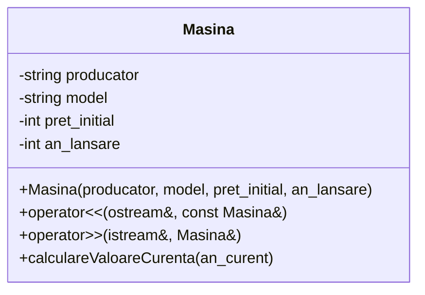

# Laborator 2

## Mic recap C/C++

```c++
#include <iostream>
#include <fstream>
#include <string>
using namespace std;

// Declararea unui struct
struct Student {
    int nr_matricol;
    string nume;
}
// Declararea unei variabile de tipul struct-ului se poate face și după definiția acestuia
  s;

int main() {

    // Afișarea unui mesaj în consolă
    cout << "nr_matricol =";

    // Citirea unui număr de la tastatură
    cin >> s.nr_matricol;

    // Afișarea altui mesaj
    cout << "nume = ";

    // Citirea unui singur cuvânt de la tastatură
    cin >> s.nume;

    // Dacă introducem mai multe cuvinte, ele raman în buffer, la următoarea citire acestea vor fi luate în considerare
    // Dacă nu sunt alte cuvinte, se va aștepta input de la utilizator
    cin >> s.nume;

    // Atunci când citim, caracterul pentru ENTER rămâne în buffer, îl eliminăm folosind cin.get
    // Nu ne-a afectat la celelalte întrucât nu s-a acceptat input de mărime 0
    cin.get();

    // Citirea mai multor cuvinte se poate face folosind getLine ce va citi până la '\n'
    // Aceasta va îndepărta automat caracterul ENTER din buffer
    getline(cin, s.nume);

    // Declarea unui vector de studenti alocat static (in stivă)
    // Alocarea este mai rapidă, este facută la compile time
    // Dezalocarea se face la ieșirea din scope
    Student studenti[100];

    // Declararea unui vector de studenți alocat dinamic (în heap)
    // Alocarea este făcuta în timpul rulării
    // Dezalocarea se face manual folosind delete
    // Se folosesc tool-uri pentru verificarea memory leak-uri -> Valgrind (Linux)
    Student *studenti2 = new Student[100];

    // Dezalocare unui șir alocat dinamic
    delete []studenti2;


    // [] este folosit doar atunci când dezalocam un șir
    Student *aux = new Student;
    delete aux;


    // Declararea unui fișier de intrare
    ifstream input("input.txt");

    input >> s.nr_matricol;
    getline(input, s.nume);

    // Închidem fișierul după ce terminăm de citit
    input.close();

    // Declararea unui fișier de afișare
    ofstream output("output.txt");

    output << s.nume << " " << s.nr_matricol;

    // Închidem fișierul după ce terminăm de afișat
    // Folosim flush dacă vrem să scriem și să nu il închidem momentan
    output.close();

    // Dacă nu avem un return definit, avem unul implicit
}
```
## C++ additions

### Supraîncărcarea funcțiilor

Putem defini funcții în același scope cu același nume dar ce primesc argumente diferite.

Supraîncărcarea nu este posibilă doar prin tipul de date de ieșire.

```c++
void doSomething(int x, int y) {
    // ...
}

void doSomething(int y) {
    // ...
}

//int doSomething(int y) {
// error: functions that differ only in their return type cannot be overloaded
// }
```

### Pasarea prin referință

Pentru a evita copierea inutilă a obiectelor (ca argumente) sau pentru modificarea mai ușoară a variabilelor folosite în interioriul funcțiilor (evitând folosirea de pointeri)

```c++
void doSomething(int &refX) {
    refX += 1;
}

int main() {
    int x = 5;
    doSomething(x);
    // x is now 6
}
```

### Argumente implicite
Atunci când scriem o funcție, putem să setăm pentru ultimele argumente valori implicite.

Atunci când apelăm funcția, putem omite argumentele implicite.

Atenție! Nu putem sări peste argumente. 

```c++
// x va trebui să primească de la tastatură mereu valori
// y și z pot fi omise
// când apelăm funcția, nu putem sări peste y dacă vrem să schimbăm valoarea lui z
void doSomething(int x, int y = 3, int z = 5) {
    // ...
}

int main() {
    // x primește valoarea 6
    // y primește valoare 2
    // z folosește valoarea implicită 5
    doSomething(6, 2);
}
```

### Alocarea dinamica prin new și delete

Au avantajul că apelează constructorul fără parametrii

```c++
Student *p = new Student(2); // Apelează constructorul cu parametrii 
Student studenti = new Student[100]; // Apelează constructorul fără parametrii pentru fiecare element din șir

// Pentru a elibera memoria ( + apelare destructor)
delete p;
delete []studenti;
```

## Clase & Obiecte

**Clasele** reprezintă un schelet pentru un *obiect*.

### Definirea unei clase

Definirea unei clase se face folosind keyword-ul **class**

```c++
class Student{
    
};
```

### Crearea obiectelor

Un **obiect** este o instanță a unei clase.

Pentru a crea un obiect, trebuie să apelăm **constructorul** clasei. O clasa poate avea mai mulți constructori prin **supraîncărcarea funcțiilor**.

Prin constructor creăm o instanță a unei clase și are rol de inițializare.

Definirea unui constructor se face creând o metodă cu acelși nume ca al clasei.

**Destructorul** se apelează automat în momentul în care obiectul creat va fi distrus. Are ca scop efectuarea unui clean-up (în special a memoriei alocate dinamic)

Definirea unui destructor se face creând o metodă cu același nume ca al clasei precedat de ~.

Fiind metode speciale, constructor-ul și destructor-ul nu au definit un tip de ieșire.

```c++
#include <iostream>
#include <string>
using namespace std;

class Student{
private:
    int nr_matricol;
    string nume;
public:

    // Declararea unui constructor
    Student(int nr_matricol, string nume) {
        this->nr_matricol = nr_matricol;
        this->nume = nume;
    }

    // Declararea unui constructor de copiere
    Student(const Student &aux) {
        this->nr_matricol = aux.nr_matricol;
        this->nume = aux.nume;
    }

    // Declararea unui destructor
    ~Student() {
        nr_matricol = 0;
        nume.clear();
    }

} // Se apelează constructorul pentru s1
s1 (1, "1");

int main() {
    // Se apelează constructorul pentru s2
    Student s2 (2, "3");

    // Se apelează destructorul pentru s2
}

// Se apelează destructorul pentru s1
```

### Metode implicite

Orice clasă are implicit dacă nu are deja definit:
 * un constructor fără parametrii
 * un constructor de copiere ()
 * un destructor
 * supraîncărcarea operatorului de asignare (=)

Astfel, codul urmator este valid:

```c++
class Student{

};

int main() {
    // Instanțierea clasei Student, se apelează constructorul fără parametrii
    Student s;

    // Apelarea constructorului de copiere
    Student s2(s);
    Student s3 = s;

    // Apelarea constructorului fără parametrii
    Student s4;

    // Apelarea operatorului de asignare
    s4 = s2;

    // Apelarea destructorului in ordinea inversă a definirii
    // Se apelează destructorul pentru s4
    // Se apelează destructorul pentru s3
    // Se apelează destructorul pentru s2
    // Se apelează destructorul pentru s1
}
```

### Date membre & funcții membre (metode) 

Clasele pot să **encapsuleaza** alte variabile și funcții.

```c++
class Student{
    int nr_matricol;
    string nume;
    void doSomething();
};
```

### Vizibilitate

Vizibilitatea unei date membre sau a unei metode se refera de locul de unde poate să fie accesată

| Specificator de access      | Efect |
| ----------- | ----------- |
| private      | poate fi accesat doar în interiorul clasei |
| protected    | poate fi accesat doar în interiorul clasei, sau din interiorul unei clase derivate|
| public | poate fi accesat fie din clasă, fie din obiect|

Implicit, toate datele definite în clasă sunt **private**.

```c++
class Student{
// private: -> Nu este necesar intrucat datele sunt implicit private, însă îl putem pune pentru vizibilitate

/* 
  Date membre & funcții private
*/

protected:

/* 
  Date membre & funcții protected
*/

// Se aplică pentru toate până la următorul specificator de access

public:

/* 
  Date membre & funcții publice
*/

private: 
// Putem reveni oricând la altă vizibilitate
};
```

### Lucrul cu metode

O metodă a unei clase are access la toate datele și metodele definite in cadrul acesteia.

În interiorul unei metode datele membre pot fi accesate direct, cât timp nu există un conflict de nume (shadowing).

În cazul în care acest lucru se întâmplă, putem folosi pointer-ul **this** care permite accesul la clasa căreia îi corespunde metoda.

``` c++
#include <iostream>
using namespace std;

class Student{
private:
    int nr_matricol;
    void exemplu_functie_privata() {

    }
public:
    // Funcție setter pentru nr_matricol
    void setNrMatricol(int nr_matricol) {
        // Întrucât argumentul are același nume ca o dată membră, aceasta nu poate fi folosită direct
        // Folosim pointer-ul this pentru a accesa aceste date
        this->nr_matricol = nr_matricol;
    }

    void increaseNrMatricol() {
        // Se apelează asupra datei membre întrucât în acest scope nu există alt nr_matricol definit.
        nr_matricol++;
        exemplu_functie_privata();
    }

    // Funcție getter pentru nr_matricol
    int getNrMatricol() {
        return nr_matricol;
    }
};

int main() {
    Student s;

    // Datele private NU pot fi accesate din instanța clasei
    // cout << s.nr_matricol;
    // error: 'nr_matricol' is a private member of 'Student'

    // Accesul la aceste date poate fi făcut prin metode publice
    
    // Folosirea unui setter pentru a seta valoarea.
    s.setNrMatricol(5);

    // Folosirea unui getter pentru accesarea datelor private pentru afișare
    cout<<s.getNrMatricol();
}
```

### Friend

Folosind specificatorul **friend** putem face ca o funcție externă sau o altă clasă (orice funcție din interiorul ei) să aibă acces la datele private ale unei clase.

```c++
// Definim clasa aici ca să putem să o referențiem în clasa Student
class Secretariat;

class Student {
    int nr_matricol;

    // Definim clasa Seceretariat ca clasă friend
    friend class Secretariat;
    
    friend int exportNrMatricol(Student &student) {
        return student.nr_matricol;
    }
};

class Secretariat {
    // Folosim clasa student
    void doSomething(const Student &student) {
        // Avem acces la date membre private
        cout << student.nr_matricol;
    }
};
```

### Supraîncărcarea operatorilor

Ne permite să definim comportamentul unui obiect în fața operatorilor.

```c++
class Student{
    int nr_matricol;
    string nume;
public:
    // Supraîncărcarea operatorului ca funcție membră
    // Primește ca argument o referință ca să prevină copierea ca argument
    Student& operator=(Student &aux) {
        // previne copierea în cazul în care e același obiect
        if (this == &aux) {
            return *this;
        }
        this->nr_matricol = aux.nr_matricol;
        this->nume = aux.nume;

        // Întoarce o referință ca să prevină o copiere la asignare în caz că dăm chain assignment.
        return *this;
    }

    // Supraîncărcarea operatorului ca funcție non-membră folosind friend
    // Deși funcția este definită în interiorul clasei, compilatorul vede specificatorul friend și stie că defapt este o funcție non membră
    friend Student& operator+(Student& student, int x) {
        Student *aux = new Student(student);
        aux -> nr_matricol += x;
        return *aux;
    }

};

//// Supraîncărcarea operatorului ca funcție non-membră
//Student& operator+(Student& student, int x) {
//    Student *aux = new Student(student);
//    aux->setNrMatricol(student.getNrMatricol() + x);
//    return *aux;
//}
```

Nu pot fi supraîncărcați urmatorii operatori:
  * "." (accesarea unui membru, operatorul "punct")
  * "? :" (ternar / conditional operator)
  * "::" (operator de rezolutie)
  * operatorul ".*" (pointer to member)
  * sizeof
  * typeid

Operatorii următori pot fi supraîncărcați doar ca funcție membră:
  * "="
  * "( )" 
  * "[ ]" 
  * "->"


Supraîncărcarea operatorilor de comparare se face printr-o funcție ce returnează o variabilă de tip bool

```c++
friend bool operator>(const Student &a, const Student &b)
```

Supraîncărcarea operatorilor este esențială atunci când vrem să folosim diferite funcții utilitare (de exemplu sort pe un std::vector)


### Variabile constante

Putem definii variabile constante folosind `const`. Acesta NU permite ca valoarea acelei variabile să se schimbe (primim eroare de compilare)

```c++
int main() {
    // definirea unui int const
    const int x = 10; // varbiabilele constante pot primi valoare doar la inițializare

    const int y = 21;


    const int * p_x = &x; // pointer la const int

    // valoarea pointer-ului poate fi schimbată
    p_x = &y;

    // dar valoare din pointer nu
    // (*p_x) = 10; 
    // error: read-only variable is not assignable


    const int * const cp_x = &x; // pointer constant la o variabila de tipul const int

    // valoare pointer-ului nu mai poate fi schimbată
    // cp_x = &y;
    // error: cannot assign to variable 'cp_x' with const-qualified type 'const int *const'
}
```

### Obiecte constante

Crearea unui obiect constant duce la necesitatea inițializării acestuia la momentul declarării.

O dată creat, datele membre ale acestuia nu mai pot fi schimbate.

Pentru a asigura asta, asupra obiectelor declarate constante pot fi apelate doar metode care declară că nu modifică obiectul

```c++
class Data {
    int x;
public:
    Data(int x) {
        this->x = x;
    }

    // modificatorul const promite că nu modifică obiectul
    int getX() const {
        return x;
    }

    // deși metoda nu modifică obiectul, nu poată fi apelată asupra obiectelor declarate const
    int get_X_non_const() {
        return x;
    }

    void setX(int x) {
        this->x = x;
    }

};

int main() {
    const Data x(5);
    x.getX();
    
//    x.get_X_non_const();
//    error: 'this' argument to member function 'get_X_non_const' has type 'const Data', but function is not marked const
}
```

### Câmpuri mutable

Câmpurile declarate `mutable` în interiorul clasei pot fi schimbate, chiar dacă sunt apelate de funcții declarate `const`

```c++
class Data {
    mutable int x;
public:
    Data(int x) {
        this->x = x;
    }

    void setX(int x) const {
        this->x = x;
    }
};

int main() {
    const Data x(5);
    x.setX(10);
}
```

## Relații între obiecte

### Compunerea

Compunerea între două obiecte apare atunci când un obiect face parte din celălalt. Dispariția obiectului "părinte" va duce la dispariția celuilalt.

```c++
class Heart {

};

class Human {
private:
    Heart heart;
public:
    Human() {
        this->heart = Heart();
    }
    Human(Heart &heart) {
        this->heart = heart;
    }
};
```

### Agregarea

Agregare apare atunci când un obiect deține un alt obiect, însă dispariția primului obiect nu implică dispariția celui de-al doilea.

```c++
class Persoana {

};

class Apartament {
private:
    vector<Persoana*> locatar;
public:
    void addPerson(Persoana *persoana) {
        locatar.push_back(persoana);
    }
    ~Apartament() {
        // Distrugerea apratamentului le permite locatarilor să se mute
        locatar.clear();
    }
};
```

## Exerciții

1. Scrieți un program în C++ care să conțină (1p):
   * clasa Mașină cu datele membre: producător, model, preț_lansare, an_fabricație
     * constructor de inițializare cu toți parametrii
     * destructor, constructor de copiere, operator de =, dacă considerați că sunt necesari, dacă nu considerați menționati de ce
     * supraîncarcarea operatorului de << pentru afișare (ostream)
     * supraîncarcarea operatorului de >> pentru intrare (istream)
     * funcția dată membru .calculareValoareCurenta(an_curent) care in funcție de ce an primește ca argument va calcula noua valoare a mașinii. În fiecare an o mașină iși pierde valoarea cu 5% din prețul acelui an. Deci în 2024 o mașina va avea un preț. În 2025, 95% din prețul din 24. În 2026, 95% din prețul din 2025, etc. 

2. Completați codul următor astfel încât să compileze (2p):

```c++
#include <iostream>

int main() {
    Telefon t("Producator", "Model");

    t.aplicatie_apel();

    t.apeleaza("XXXXXXXXXX"); // poate fi accesat doar din 'ecranul' în care intrăm prin funcția precedentă

    std::cout << ~t; // va afișa ultimul număr format

    t.aplicatie_apel();

    t.creeaza_contact("XXXXXXXXXX", "BBBB"); // poate fi accesată doar din 'ecranul' funcției precedente

    t["XXXXXXXXXX"]; // va returna numele contactului cu numărul "XXXXXXXXXX" "BBBB"

    std::cout << t;
}
```

3. Considerați clasa:

```c++
#include <iostream>

class Example {
public:
    Example() {
        std::cout << "A";
    }
    Example(const Example &aux) {
        std::cout << "B";
    }
    ~Example() {
        std::cout << "C";
    }
};
```

Creați o funcție main, care folosind clasa de mai sus să afișeze pe ecran: `ABACAAAAAACCC` (3p).


-------------------
x. Completați codul următor astfel încât să funcționeze:

```c++
int main() {
    Carte C("Book Name", "Author Name", 2024);

    Carte D;

    std::cin >> D;

    if (C == D) {
        std::cout << "Cartile sunt la fel";
        return 1;
    }

    std::cout << D.genereazaSimilaritate();

    Carte e = C + D;

    std::cout << e;
}
```
(solution [here](./example/main.cpp))
