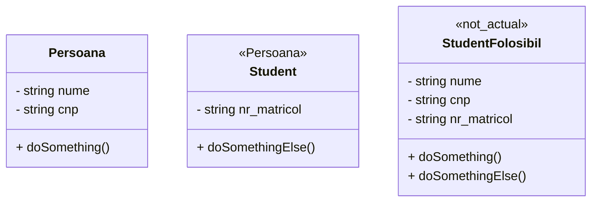

# Laborator 4

## Reminder const everywhere

Folosiți const oridune puteți:
  * pentru variabile declarate în funcții
```c++
int main() {
    const int x = 0;
}
```
  * ca argumente la funcții (și pasat prin referință)
```c++
void doSomething(const int &x) {
    // use x without modifying it
} 
```
  * obiectele instanțiate cu `const` pot folosii doar metode care declară acest lucru
```c++
class Example {
public:
    void doSomething() const {
        // nu pot modifica nicio dată membră
    }

    void doNothing() {
        // pot modifica nicio dată membră
    }
}

int main() {
    const Example e;
    e.doSomething(); // merge
    // e.doNothing(); nu este declarată const, nu merge
}
```
* pentru referințe la date membre private returnate prin getteri
```c++
class Example
{
    int x;

public:
    const int &getX() const { return x; } /
    int &badGetX() { return x; }
};

int main()
{
    const Example e;
    e.getX() = 3; // nu merge, ceea ce ne și dorim

    // e.badGetX() = 5;
    // data membră privată poate fi modificată atunci când întoarcem o referință non-const,
}
```

## Date membre const

* atunci când folosim date membre `const` acestea pot fi inițializate doar prin **lanțul de inițializare** al constructorului

```c++
class Example
{
    const int x;
public:
    Example(const int &x_value) : x(x_value) {
        // cand folosim datele membre aici, ele ar avea deja o valoare implicită
        // astfel, câmpurile const nu ar putea fi modificate
    }
};
```

## Moștenirea

Prin moștenire putem să creăm o clasă care extinde o altă clasă. 

Clasa derivată va avea toate datele membre și funcțiile clasei de bază

### Exemplu

Considerăm clasa:
```c++
class Persoana
{
private:
    string nume;
    string cnp;

public:
    int doSomething()
    {
        return 5;
    }
};
```

Dupa numele clasei noi speficăm tipul de derivare (public) și numele clasei din care moștenim.

```c++
class Student : public Persoana
{
// clasa derivată poate să își declare date membre specifice ei
private:
    string numar_matricol;

public:
    int doSomethingElse()
    {
        return 10;
    }
};

int main()
{
    Student s;
    // avem acess la date & funcții membre din clasa de bază
    cout << s.doSomething() << endl;

    // putem folosii doar funcții din clasa derivată       
    cout << s.doSomethingElse() << endl;
}
```

**Vizualizare a cum ar arăta definițiile claselor**





### Cum se mostenește?

Depinde de modul cum se face derivarea

La laborator folosim doar moștenire **public**. Acesta înseamnă:

* câmpurile private din clasa de bază, nu pot fi accesate din interiorul clasei derivate
* câmpurile protected din clasa de bază, pot fi accesate din ulterioarele clase derivate însă nu și din exterior (din obiect)
* câmpurile public din clasa de bază, rămân publice în clasele derivate.

**Atenție** Ideal este să folosiți specificatorul minim de care aveți nevoie.

```c++
class A
{
private:
    int a;

protected:
    int b;

public:
    void doSomething();
};

class B : public A
{
public:
    void doSomethingElse()
    {
        // cout << this->a; // nu avem acces, error: 'a' is a private member of 'A'
        cout << this->b;     // avem acces la campurile protected
        this->doSomething(); // avem acces la campurile public

        // putem accesa elementele din clasa de baza si folosind operatorul de rezolutie
        cout << A::b;
        A::doSomething();
    }
};

class C : public B
{
    void neverStopDoingSomething()
    {
        cout << this->b;     // avem acces la campurile protected
        this->doSomething(); // avem acces la campurile public
    }
};
```

### Comportamentul constructorului la derivare

Atunci când o clasă derivată este construită, se apelează mai întâi constructorul clasei de bază și apoi cel al derivatei.

Atunci când definim explicit un constructor pentru o clasă derivată, acesta apeleaza implicit constructorul fara parametrii al clasei de bază, dacă nu există, trebuie să apelăm explicit un constructor


```c++
class Persoana
{
private:
    string nume;
    string cnp;

public:
    Persoana(const string &nume, const string &cnp) : nume(nume), cnp(cnp)
    {
    }
};

class Student : public Persoana
{
private:
    string numar_matricol;

public:
    Student(const string &numar_matricol, const string &nume, const string &cnp) : Persoana(nume, cnp), numar_matricol(numar_matricol)
    {
    }
};
```

Constructorul implicit al unei clase derivate va apela constructorul implicit al unei clase de bază.

### Comportamentul destructorului la derivare

* Se apeleaza în ordinea inversă a constructorului
  
```c++
class Persoana
{
public:
    ~Persoana()
    {
        cout << "A";
    }
};

class Student : public Persoana
{
public:
    ~Student()
    {
        cout << "B";
    }
};

int main() {
    Student s;
    // o să fie afișat BA
}
```

### Comportamentul constructorului de copiere la derivare

Dacă nu avem nimic definit, atunci compilatorul o să genereze un constructor de copiere care copiază membru cu membru.

Dacă definim constructor de copiere în clasa de derivată, atunci acesta trebuie să copieze și datele membre ale clasei de bază.

```c++
class Persoana
{
protected:
    string nume;
};

class Student : public Persoana
{
    string numar_matricol;

public:
    Student(const string &nume, const string &numar_matricol) : Persoana()
    {
        this->nume = nume;
        this->numar_matricol = numar_matricol;
    }
    Student(const Student &aux): Persoana(aux)
    {
        this->numar_matricol = aux.numar_matricol;
    }
};
```

### Rescrierea funcțiilor în clasa derivată

Putem definii funcții cu același nume în clasa derivată cu unele din clasa de bază.

Pentru obiectele derivate, se va folosii comportamentul funcției rescrise.

Dacă rescriem o funcție dar cu alți parametrii, se va pierde accesul direct la funcția din clasa de bază.

```c++
class Persoana
{
public:
    void doSomething()
    {
        cout << "A";
    }
    void doSomethingElse() {
        cout << "C";
    }
};

class Student : public Persoana
{
public:
    void doSomething()
    {
        cout << "B";
        // avem acces la funcția din clasa de bază prin operatorul de rezoluție
        // Persoana::doSomething();
    }
    int doSomethingElse(const int &x) {
        cout << x;
        return x;
    }
};

int main()
{
    Student s;
    // s.Persoana::doSomething(); // putem accesa funcția din clasa de bază prin operatorul de rezoluție
    s.doSomething();
    // va afisa B

    // s.doSomethingElse(); // nu mai avem acces direct
    s.doSomethingElse(6);
    // afiseaza 6
}
```

### Upcasting

Ne permite să folosim obiecte de tipul clasei derivate în 
funcții scrise cu tipul de clasei de bază.

```c++
class Persoana{};

class Student : public Persoana{};

void doSomething(const Persoana &p) {}

int main()
{
    Student s;

    doSomething(s);
}
```

### Probleme cu upcasting (early-binding)

Atunci când folosim direct obiecte, compilatorul știe la compilare tipul de date, deci își dă seama ce funcții să apeleze

Problema apare atunci când se folosesc adrese de memorie la clasa de bază în care punem obiecte de tipul derivată.

La rulare, nu se vor apela funcțiile clasei derivate, ci cele ale clasei de bază.

```c++
class Persoana
{
public:
    void doSomething()
    {
        cout << "A";
    }
};

class Student : public Persoana
{
public:
    void doSomething()
    {
        cout << "B";
    }
};

int main()
{
    Student s;
    Persoana *p = &s;
    p->doSomething();
    // Se afișează A, desi avem obiect de tipul derivată.
}
```
### Soluție? Funcții virtuale (late-binding)

Funcțiile virtuale se definesc cu keyword-ul virtual în clasa de bază (DOAR în clasa de bază) și ne asigură că comportamentul precedent este evitat.

```c++
class Persoana
{
public:
    // !!!!!!!!!!!!!!!!!!!!!!!
    virtual void doSomething()
    {
        cout << "A";
    }
    // !!!!!!!!!!!!!!!!!!!!!!!


    void doSomethingElse()
    {
        cout << "A";
    }
    
};

class Student : public Persoana
{
public:
    void doSomething()
    {
        cout << "B";
    }

    void doSomethingElse()
    {
        cout << "B";
    }
};

int main()
{
    Student s;
    Persoana *p = &s;
    p->doSomething();
    // Se afișează B, întrucât avem virtual

    p->doSomethingElse();
    // Se afiseaza A, funcția nu este virtual
}
```

**Atenție!** 

În general, destructroul va fi declarat virtual, ca să ne asigurăm că este apelat atunci când lucrăm cu pointeri la clasa de bază și avem derivate.


### Run-Time Type Identification (RTTI) 

Problema precedentă apărea pentru că programul nu știa la timpul rulării cu ce tip de obiect lucra în interiorul pointerului.

Folosind keyword-ul `virtual` pe cel puțin o funcție activăm magie care face posibilă interacțiunea precedentă.

Un alt lucru activat, este posibilitatea de identifica tipul obiectelor memorate la adresele de memorii.

#### Downcast (bad way)

Downcast înseamnă folosirea unui tip de clasă de bază în locul unei clase de date derivat.

```c++
class Persoana
{
public:
    virtual void doSomething()
    {
        cout << "A";
    }

    void doSomethingElse()
    {
        cout << "A";
    }
};

class Student : public Persoana
{
public:
    // !!!!!!! CLAR GRESIT !!!!!!!
    int x;
    // !!!!!!! CLAR GRESIT !!!!!!!

    void doSomething()
    {
        cout << "B";
    }

    void doSomethingElse()
    {
        cout << "B";
    }
};

int main()
{
    Student s;
    Persoana *p = &s;

    // !!!!!!!!!!!!!!! GRESIT !!!!!!!!!!!!!!!!
    Student *p_s = (Student *)p; // asta ne-am dorii prin castare
    p_s->doSomethingElse();      // afiseaza B
    // !!!!!!!!!!!!!!! GRESIT !!!!!!!!!!!!!!!!

    // de ce?
    Persoana pp;
    p_s = (Student *)&pp;
    p_s->doSomethingElse(); // afiseaza B
    // Downcast-ul în stilul acesta ne permite să creăm pointeri la derivată din obiecte de tipul de bază
    // Ne permite să accesăm zone de memorie în care nu am avea access
    cout << p_s->x;
    // variabila x este definită doar în clasa derivată
    // totuși printr-un pointer în stilul acesta avem acces la o zonă de memorie pentru o variabilă x care nu ne este atribuită

}
```

<details close>
<summary>Exemplu</summary>

```c++
#include <iostream>
class A {
private:
    int x; 
public:
    const int& getX() const { return x;}
    void setX(const int &x) { this->x = x;}
};

class B: public A {
    int y; 
public:
    const int& getY() const { return y;}
    void setY(const int &y) { this->y = y;}
};
    
int main() {
    // Alocam dinamic doua obiecte de tipul A, ce va determina sa se aloce 
    // 8 bytes de memorie consecutivi
    A *p = new A[2];
    
    // din cei 8 bytes, primi 4 vor fi pentru primul obiect
    p[0].setX(1);
    
    // urmatorii 4 vor fi pentru al doilea obiect
    p[1].setX(2);
    
    std::cout << p[0].getX() << " " << p[1].getX() << std::endl;
    // 1 2
    
    // cand facem static cast in clasa derivata din adresa unei clase de baza
    // interpretam cei 8 bytes de memorie ca fiind doar pentru clasa noastra
    B *b = (B *) &p[0];
    
    // il modificam pe Y 
    b->setY(5);
    
    // se modifica X-ul obiectului creat 2
    std::cout << p[0].getX() << " " << p[1].getX() << std::endl;

    return 0;
}
```
</details>

#### Smarter Downcast, Dynamic Cast

Dynamic Cast folosește tabelele virtuale pentru a identifica tipul obiectului.


```c++
class Persoana
{
public:
    virtual ~Persoana() // minim o functie virtuala pentru dynamic cast
                        // si RTTI
};

class Student : public Persoana
{
};

int main()
{
    Persoana p;
    Student s;
    Persoana *pp = &s;

    // Avem adresa de memorie catre un obiect de tipul Student
    // Apelam dynamic cast pe acel pointer
    Student *ss = dynamic_cast<Student *>(pp);
    // dynamic_cast<tip de data dorit>(adresa de memorie de interpretat)

    ss = dynamic_cast<Student *>(&p);
    // dynamic_cast returneaza nullptr cand nu se poate face atribuirea
    if (ss == nullptr)
    {
        cout << "Este null";
    }
}
```

#### TypeInfo

`typeinfo` ne permite să aflăm tipul real al unui obiect în timpul execuției.

```c++
#include <typeinfo>

class Persoana
{
public:
    // !!!!!!!!!!! 
    // In absența lui virtual nu am avea informații ale derivate prin pointeri la clasa de bază
    virtual ~Persoana()
    {
    }
    // !!!!!!!!!!!
};

class Student : public Persoana
{
};
int main()
{
    Student s;
    Persoana *pp = &s;
    cout << typeid(*pp).name() << endl; // o sa afiseze 7Student, numarul de caracter al numelui clasei + numele clasei
    cout << typeid(pp).name() << endl;  // o sa afiseze P8Persoana, Pointer 8 caractere nume clasa
    cout << typeid(&pp).name() << endl; // o sa afiseze PP8Persoana, Pointer la pointer 8 caractere nume clasa

    // typeid returneaza un obiect, putem sa il comparam
    if (typeid(pp) == typeid(Persoana *))
    {
        cout << "O sa se execute" << endl;
    }

    if (typeid(*pp) == typeid(Student))
    {
        cout << "O sa se execute" << endl;
    }

    if (typeid(*pp) == typeid(Persoana))
    {
        cout << "Nu o sa se execute" << endl;
    }
}
```

### Clase abstracte

O clasă abstracte are CEL PUȚIN o funcție virtual pură și nu pot să fie instanțiate.

Orice derivată trebuie să rescrie acea funcție, altfel o să fie și ea abstractă.

Se folosește ca pointer pentru clasele derivate.

```c++
class AbstractClass
{
public:
    // !!!!!!!!!!!
    // Funcție virtual pură
    virtual void doSomething() = 0;
    // !!!!!!!!!!!
};

class Derivata : public AbstractClass
{
public:
    void doSomething()
    {
        // implementam metoda
    }
};

int main()
{
    // !!! NU PUTEM INSTANTIA
    // AbstractClass e;
    // error: variable type 'AbstractClass' is an abstract class
    // note: unimplemented pure virtual method 'doSomething' in 'AbstractClass'

    // Putem folosii pointer la o clasa abstracta
    AbstractClass *e = new Derivata();

    // apelam functia prin clasa de abastracta
    e->doSomething();
}
```

## Static

Variabilele declarate static funcționează asemănător cu variabilele globale,
sunt memorate o singură dată per execuția programului.

Putem avea variabile și funcții statice pentru o clasă, accesarea lor se face prin intermediul numelui clasei.

```c++
class Example
{
    // data membru statica
    // va ocupa memorie o singura data, indiferent de numarul de clase
    // se va ocupa memoria fix la rularea programului
    static int x;
    // error: non-const static data member must be initialized out of line

public:

    // functie statica
    static void doSomething()
    {
        // in interiorul ei aveam acces DOAR la datele membre statice
        Example::x++;
    }

    void doSomethingElse()
    {
        // putem accesa date membre statice si in interiorul functiilor definite in functie
        cout << Example::x;
    }
};

// Declaram in afara clasei
// Intr-un fisier .cpp (deci nu in headere)
int Example::x = 0;

int main()
{
    // accesam functia statica folosind operatorul de rezolutie pe clasa
    Example::doSomething();
}
```

## Exception handling

* `try` {} -> permite folosirea imediat următore a unui bloc `catch`
* `catch` (tip_de_data nume_variabila) {} -> dacă in interiorul blocului `try` anterior apare o eroare cu tip_de_date (sau o bază a acesteia), daca apare o exceptie, se vor executa instructiunile din blocul `catch` și se continuă execuția după blocul `catch`, daca în blocul `try` în care a apărut excepția nu are un catch corespunzător, o să se iasă din funcție până când se găsește, dacă nu se găsește atunci programul se oprește
* `throw` nume_variabilă -> aruncă o excepție de tipul nume_variabila,oprește executia blocului curent, căutând cel mai apropiat bloc de catch, dacă blocurile de catch din `try`

```c++
void doSomething()
{
    // pregatim tratarea de erori deschizand o bucla precedata de try
    try
    {
        // apelam functiile in stilul norma
        throw 3.0;

        cout << "Blocul acesta nu se mai executa pentru ca s-a aruncat o exceptie precedent";
    }
    // putem folosii catch doar dupa un bloc deschis cu try
    catch (char x)
    {
    }

    cout << "Nu o sa ma execut pentru ca blocul catch nu a prins eroarea din try";
}

int main()
{
    try
    {
        doSomething();
        cout << "Nu o sa ma execut pentru ca in doSomething apare o exceptie";
    }
    catch (int x)
    {
    }
    // putem avea mai multe blocuri de catch
    // se va executa doar primul care corespunde
    catch (double x)
    {
        cout << "Am prins un double " << x << endl;
    }

    cout << "Se continua executia programului" << endl;
}
```

**Atenție** când aruncați obiecte cu tip derivat. Faceți `catch`-urile cât mai specifice.

```c++
class Baza
{
};
class Derivata : public Baza
{
};

int main()
{
    try
    {
        throw Derivata();
    }
    catch (Baza x)
    {
        // exceptia aruncata este Derivata, deci este si de tip Baza
        cout << "O sa ma execut pentru ca am prins o baza sau o derivata";
    }
    catch (Derivata x)
    {
        // warning: exception of type 'Derivata' will be caught by earlier handler [-Wexceptions]
        cout << "Nu o sa ma execut pentru ca o sa se foloseasca blocul anterior de catch pentru ca este mai general";
    }
}
```


Exercițiu (4p):

Tim a observat că are nevoie de un sistem de gestiune a fișierelor pentru a-și eficientiza modul de lucru.
Ca să își testeze ideea de aplicație, va scrie un program in C++ folosind programarea orientată obiect.

Pentru a-și rezolva ideea, el identifică următoarele clase.

    * Observă că fiecare item în gestiune are un nume
    * Observă că fiecare fișier are o dimensiune și o extensie
    * Observă că fiecare folder are în interior un vector de fișiere sau foldere (un singur vector, le cuprinde pe ambele).

Creați ierarhia de clase și faceți ca următorul program main să funcționeze

```c++
int main() {
    // Item i; can't make a object of class i
    Directory root("/");
    root.addItem(new Directory("bin"));
    root.addItem(new Directory("home"));
    Directory *home = root.navigateTo("home");
    home->addDirectory("tim")
    Directory *tim = home->navigateTo("tim");
    tim->addItem(new File("info", "txt", 100))
    tim->addItem(new File("data", "in"))
    tim->addItem(new Directory("data", "in");

    cout << root.getSize() << endl;
    cout << root.getNumberOfItems() << endl;
    cout << root;
    // va fi vizibila o ierarhie de itemi
    /*
        /
        |-bin
        |-home
          |_tim
            |_info.txt 100
            |_data.in 0
            |_data
    */
}
```

Adițional (2p):

    * Adăugați support pentru pentru symbolic links. Pe scurt, acestea sunt shortcut-uri către alte fișiere sau foldere. 
    * Ilustrați comportamentul de symlink (accesarea unui simlink este defapt accesarea directa a fisierului sau al directorului) insa nu au size

Pentru afisarea ierarhiei puteti modifica codul urmator:

```c++
#include <iostream>
#include <vector>
using namespace std;

class Item {
 private:
  static void identantion(int level = 0) {
    for (int i = 0; i < level - 1; i++) {
      cout << "  ";
    }
    if (level > 0) {
      cout << "|-";
    }
  }

 public:
  // NU FACETI ASTA LA EXAMEN
  vector<Item> items;
  // NU FACETI ASTA LA EXAMEN

  void show(int level = 0) {
    // showing myself
    identantion(level);
    cout << "1" << endl;
    // showing others;
    for (auto &item : items) {
      item.show(level + 1);
    }
  }
};
int main() {
  Item mock;
  Item i;
  Item a;

  a.items.push_back(mock);
  a.items.push_back(mock);
  Item b;

  i.items.push_back(a);
  i.items.push_back(b);
  i.show(0);
}
```

afiseaza
```
1
|-1
  |-1
  |-1
|-1
```