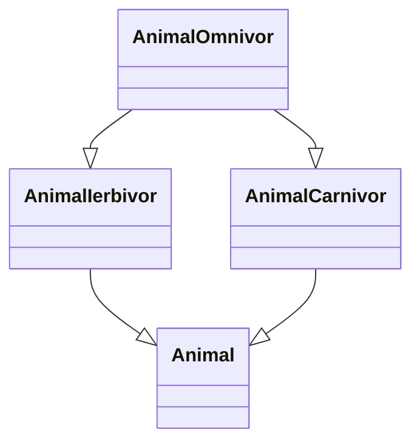
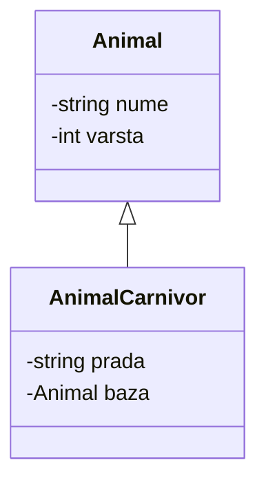
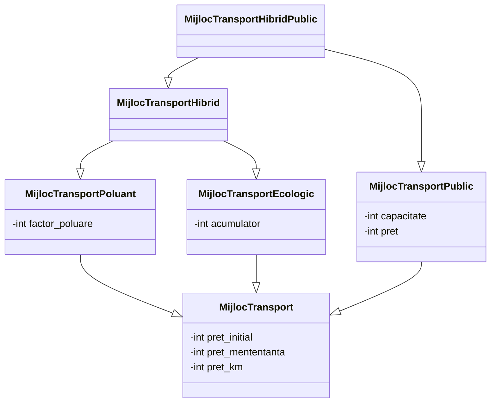
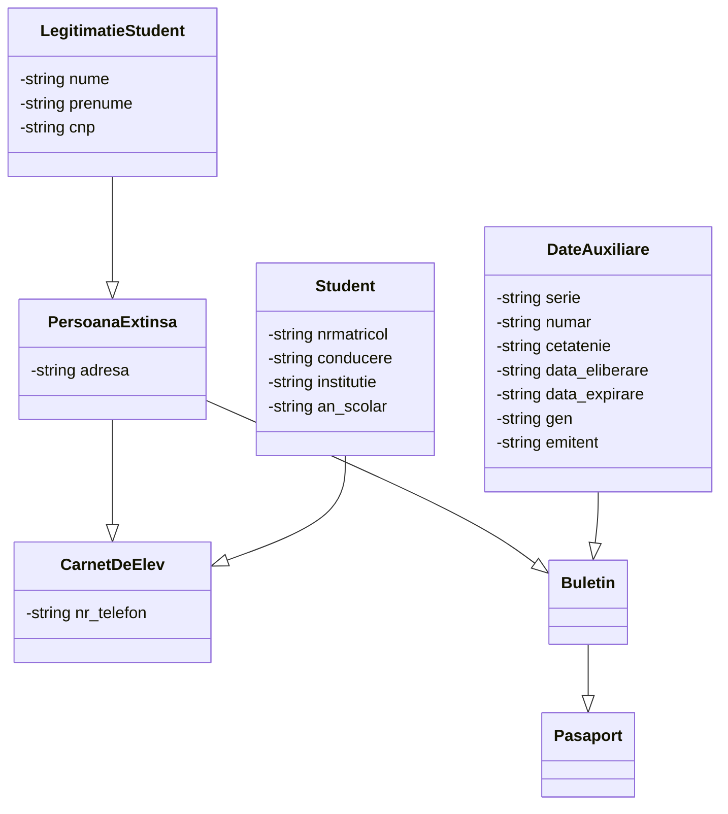

## Laborator 5

### Moștenirea multiplă

Consideram urmatoarele clase:

```c++
class Animal {
protected:
    string nume;
    int varsta;
public:
    Animal(const string&, int);
    Animal(const Animal&);
    Animal& operator=(const Animal &);
    virtual void show(ostream&) const;
    friend ostream& operator<<(ostream&, const Animal &);
};

class AnimalCarnivor: public Animal {
protected:
    string prada;
public:
    AnimalCarnivor(const string &, const string&, int);
    AnimalCarnivor(const AnimalCarnivor&);
    AnimalCarnivor& operator=(const AnimalCarnivor &);
    void show(ostream& out) const;
};

class AnimalIerbivor: public Animal {
protected:
    string aliment;
public:
    AnimalIerbivor(const string &, const string&, int);
    AnimalIerbivor(const AnimalIerbivor&);
    AnimalIerbivor& operator=(const AnimalIerbivor &);
    void show(ostream& out);
};

class AnimalOmnivor: public AnimalCarnivor, public AnimalIerbivor {
private:
    string habitat;
public:
    AnimalOmnivor(const string &, const string &, const string &, const string&, int);

    void show(ostream& out) const;
};
```



**Problema in abordarea pana acum**

Accesarea campurilor din clasa de bază în mod direct în clasa de AnimalOmnivor duce la eroare

```
error: non-static member 'nume' found in multiple base-class subobjects of type 'Animal':
    class AnimalOmnivor -> AnimalCarnivor -> Animal
    class AnimalOmnivor -> AnimalIerbivor -> Animal


In member function 'virtual void AnimalOmnivor::show(std::ostream&) const'
error: reference to 'nume' is ambiguous
```

**De ce?**


Fiecare derivată, are de fapt un sub-obiect clasă de bază.



În exemplul de mai sus, clasa AnimalOmnivor ajunge să aibă 2x subobiecte de tipul bazei Animal.

**Cum rezolvăm?**

### Moștenire virtuală

Moștenirea virtuală previne crearea mai multor obiecte de tipul subiectelore clasei de bază atunci când se moștenesc mai multe clase cu o bază comună

```c++
class Animal {
};

class AnimalCarnivor: virtual public Animal {
};

class AnimalIerbivor: virtual public Animal {

};

class AnimalOmnivor: public AnimalCarnivor, public AnimalIerbivor {
};
```

Funcțiile care sunt moștenite din mai multe locuri trebuie să fie rescrise neapărat în clasa derivată.

```
error: no unique final overrider for 'virtual void Animal::show(std::ostream&) const' in 'AnimalOmnivor'
```

Trebuie să avem grijă la modul cum apelăm funcțiile, mai ales cele care apelează și clasele de bază pentru a evita apelarea de mai multe ori.

```c++
class Animal {
protected:
    string nume;
    int varsta;
public:
    Animal(const string& nume, int varsta): nume(nume), varsta(varsta) {
        
    }
    Animal(const Animal& aux): nume(aux.nume), varsta(aux.varsta) {
        
    }
    Animal& operator=(const Animal &aux) {
        if (this != &aux) {
            this->nume = aux.nume;
            this->varsta = aux.varsta;
        }
        return *this;
    }
    virtual void show(ostream& out) const {
        out << "Animal(nume=" << nume <<", varsta=" <<varsta << ")";
    } 
    friend ostream& operator<<(ostream& out, const Animal &aux) {
        aux.show(out);
        return out;
    }
};

class AnimalCarnivor: virtual public Animal {
protected:
    string prada;
public:
    AnimalCarnivor(const string &prada, const string& nume, int varsta): Animal(nume, varsta), prada(prada) {
        
    }
    AnimalCarnivor(const AnimalCarnivor& aux): Animal(aux), prada(aux.prada) {
        
    }
    AnimalCarnivor& operator=(const AnimalCarnivor &aux) {
        Animal::operator=(aux);
        if (this != &aux) {
            this->prada = aux.prada;
        }
        return *this;
    }
    void show(ostream& out) const {
        Animal::show(out);
        out << " | Carnivor(prada=" << prada <<")";
    }
};

class AnimalIerbivor: virtual public Animal {
protected:
    string aliment;
public:
    AnimalIerbivor(const string &aliment, const string& nume, int varsta): Animal(nume, varsta), aliment(aliment) {
        
    }
    AnimalIerbivor(const AnimalIerbivor& aux): Animal(aux), aliment(aux.aliment) {
        
    }
    AnimalIerbivor& operator=(const AnimalIerbivor &aux) {
        Animal::operator=(aux);
        if (this != &aux) {
            this->aliment = aux.aliment;
        }
        return *this;
    }
    void show(ostream& out) const {
        Animal::show(out);
        out << " | Ierbivor(aliment=" << aliment <<")";
    }
};

class AnimalOmnivor: public AnimalCarnivor, public AnimalIerbivor {
private:
    string habitat;
public:
    AnimalOmnivor(const string &habitat, const string &prada, const string &aliment, const string& nume, int varsta): Animal(nume, varsta), AnimalIerbivor(aliment, nume, varsta), AnimalCarnivor(prada, nume, varsta), habitat(habitat) {
    }
    
    AnimalOmnivor(const AnimalOmnivor& aux): Animal(aux), AnimalIerbivor(aux), AnimalCarnivor(aux), habitat(aux.habitat) {
    }
    
    AnimalOmnivor& operator=(const AnimalOmnivor &aux) {
        // apelam operatorul dintr-o clasa derivata, asa teoretic acoperim si clasa de baza
        Animal::operator=(aux);
        AnimalCarnivor::operator=(aux);
        AnimalIerbivor::operator=(aux);
        if (this != &aux) {
            // copiem si elementele mostenite din cealalta clasa
            this->aliment = aux.aliment;
            // copiem restul elementelor specifice clasei
            this->habitat = aux.habitat;
        }
        return *this;
    }
    
    void show(ostream& out) const {
        out << "AnimalOmnivor(nume=" << nume <<", varsta=" <<varsta << ", prada = " << prada <<", habitat = "<< habitat << ", aliment = " << aliment << ")";
    }
};
```

## Exemplul 1

Primăria Municipiului București vrea să analizeze datele referitoare la modul cum oamenii aleg să se deplaseze.

Ea a identificat câteva date de care ar fi interesată. Fiecare mijloc de transport va avea un preț inițial necesar, un preț de mentenanță (aproximativ) lunar și prețul aproximativ pe un kilometru parcurs în oraș.

Unele mijloace de transport au un impact dăunător asupra mediului, astfel se dorește colectarea de informații legate de factorul de poluare. Acesta reprezintă un număr investigat atent.

Unele mijloace de transport vor să combată aceste tipuri încercând să folosească moduri de obține energie mai ecologic, în general electric. Pentru acestea se va reține capacitatea acumulatorului.

Unele mijloace de transport au ca scop transportarea publicului larg, astfel pentru acestea se vor reține pretul unui bilet și numărul maxim de persoane.

De asemenea, există metode de transport hibride și în mod particular dar și în mod public. Acestea vor memora și un set de caracteristici specifice acelui mod de transport.



Să se implementeze un program orientat obiect în care
* putem afișa / adăuga un număr variabil de obiecte (de orice tip)
* fiecare modalitate de transport are un ID unic, incrementat automat
* putem calcula prețul pe o distanță introdusă de la tastatură pentru fiecare tip de transport unde:
  * pentru mijloacele poluante se multiplică prețul per kilometru cu factorul de poluare
  * pentru mijloacele de transport ecologice este aceși distanță însă se calculează și o amortizare de 0.01 a bateriei
  * pentru mijloacele de transport în comun se împarte la final prețul pentru numărul maxim de persoane transportat
* afișarea numărului din fiecare obiect

## Exemplul 2

<details>

<summary>
New
</summary>
Creați un program orientat obiect scris în C++ care să faciliteze validarea următoarelor documente.


* Carnet de student: 
  * Nr. Matricol
  * Nume & prenume
  * CNP
  * Facultate
  * Specializare
  * Data eliberare
  * Decan? 
  * Student?
  * Vize?
  * Note?
  


* Fiecare document introdus va avea un identificator unic incrementat automat.
* Creati o functie de validare ce permite validarea documentului curent
* Creati o functie ce permite validarea daca un document apartine unei persoane care detine alt document



</details>


<details>
<summary>Old</summary>
O agenție ce se ocupă administrare unei expoziții are nevoie de un program pentru ajutarea calculării datelor.

Astfel, pentru fiecare pictură se va reține titlul și numele autorului.

Fiecare pictură poate fi desenată fie în acuarelă fie în ulei.

Pentru picturile în acuarelă se va reține timpul aproximativ de uscare.

De asemenea, există picturi extrem de rare care au fost realizate și cu acarelă și în ulei, în general rezervat pentru peisaje. Pentru acestea se va memora numele peisajului după care a fost inspirat.

Expoziția va memora de căte ori a fost vizitată fiecare pictură.

Să se implementeze un program orientat obiect în care
* putem afișa / adăuga un număr variabil de obiecte (de orice tip)
* fiecare pictură are un ID unic, incrementat automat
* pentru fiecare pictură se va calcula un preț de cumpărare:
  * pentru picturile în acuarelă se calculează ca (numărul de persoane de care a fost viziat + 100) * timpul de uscare
  * pentru picturile în ulei se calculează ca 500 + (numărul de persoane de care a fost viziat * 10)
* afișarea numărului din fiecare obiect
</details>
